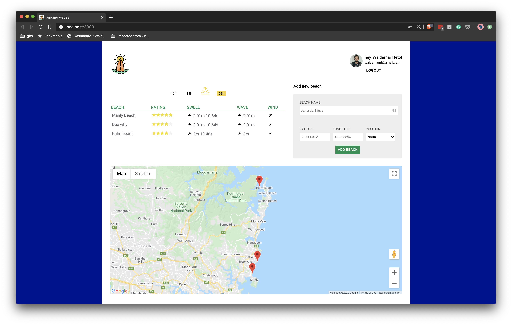

  
  
Node.js API com Typescript

Link do curso: [DO ZERO A PRODUÇÃO: APRENDA A CONSTRUIR UMA API NODE.JS COM TYPESCRIPT](https://www.youtube.com/playlist?list=PLz_YTBuxtxt6_Zf1h-qzNsvVt46H8ziKh)

## 📖 Sobre o projeto

Durante o curso é criado uma API para calcular a melhor condição de surf entre varias praias, essa API tem como objetivo servir a aplicação web (a aplicação web não é construida durante o curso pois ela não é o foco do conteúdo, ela é disponibilizada pronta).

Resultado final do curso

---

## :hammer_and_wrench: Tecnologias

💻 [Node.js](https://nodejs.org/)

🧰 [Typescript](https://www.typescriptlang.org/)

✅ [Jest](https://jestjs.io/)

📦 [MongoDB](https://www.mongodb.com/)

🛠 [Github Actions](https://github.com/features/actions)
